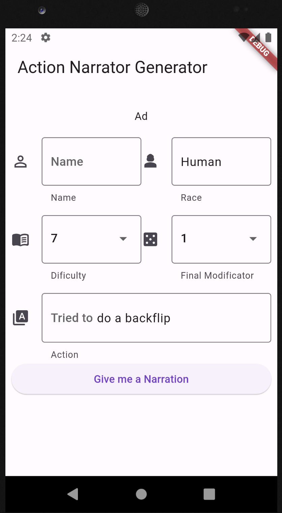

# Check it out at [ActionArtisan](https://main.dc3wixtzurzli.amplifyapp.com)

The ActionArtisan app is a tool designed to assist Dungeon Masters (DMs) in creating vivid and immersive descriptions for various actions and scenarios in their tabletop role-playing games. This app leverages the power of OpenAI's natural language generation to provide dynamic and creative narratives that enhance the gaming experience.

<!--  Replace with an actual screenshot of your app -->
</img>

## Features

- Generate Descriptions: Quickly create rich descriptions for player actions, combat sequences, environments, and more.
- Seamless Integration: The app's frontend is developed using Flutter, ensuring a smooth and intuitive user experience on Android, iOS platforms and web.
- AI-powered Narration: The app communicates with a AWS Lambda function through API Gateway, which then interacts with an OpenAI API to retrieve narrations based on the input.
- Customizable Narratives: Tailor the generated narratives by providing specific details, tones, or styles, enhancing the uniqueness of your storytelling.
- CI/CD Pipeline: Using Github Actions to build the project, and Amplify to detect the changes and deploy it automatically, the project is automized.

## Installation

1. Clone this repository: `git clone https://github.com/bepitic/ActionArtisan.git`

### AWS Lambda Backend

The app's backend is powered by AWS Lambda and API Gateway, which communicate with OpenAI's API to generate narrations. Make sure to set up the backend by following these steps:

1. Create an AWS Lambda function that handles the API Gateway requests.
2. Copy the Lambda file `Lambda_AWS/Lambda_function.py` into aws lambda.
3. Create a new Environment Variable `KEY` that will contain the API-key in order to acces OpenAI.
4. Set up an API Gateway with appropriate routes and methods(Push) to trigger the Lambda function.
5. Generate an api-key for the lambda function.

### Flutter Front-end

1. Navigate to the `explain_rol` directory: `cd explain_rol`
2. Add 3 environmental variables, `API_AUTHORITY -> link to the API`, `API_PATH ->API path`, `API_KEY -> API_KEY`
4. Install dependencies: `flutter pub get`
5. Run the app: `flutter build web  --dart-define=API_AUTHORITY=$API_AUTHORITY --dart-define=API_PATH=$API_PATH --dart-define=API_KEY=$API_KEY`

## Deployment on Amplify ( Web )

1. Create a new Web app on Amplify.
2. Connect your github account and select the repo.
3. Click on the check box to indicate that is a monorepo.
4. Select the build/web if was compiled localy.
5. Or select the artifact/web if compiled with the github actions.
6. select the default build config.
7. Wait until provision, build and deployment has finished.

## Usage

1. Launch the app on your Android or iOS device.
2. Provide the name of the character and its race.
3. Provide the difficulty of the action,and the final result of the dice(with all the modificators).
4. Tap the "Give me a Narration" button.
5. The app will send a request to the serverless backend, which communicates with OpenAI's API.
6. Once the narration is received, it will be displayed on the screen.
7. Customize the narration further or use it as-is in your game.

## Credits

- Flutter: [https://flutter.dev/](https://flutter.dev/)
- OpenAI: [https://openai.com/](https://openai.com/)

## License

This project is licensed under the [GNU-3 License](https://github.com/Bepitic/ActionArtisan/blob/main/LICENSE).
